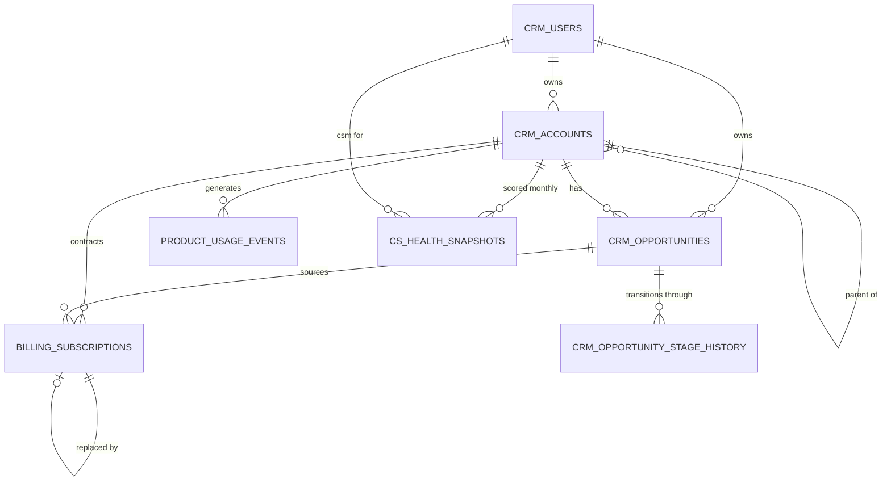

# Northwind Analytics — source schema

A map of what you've been given and how it joins, so you don't spend your time
reverse-engineering column names. It describes what each field *is*, not what state
it's in — assessing the data's condition is your job.

## How the sources connect

Join keys at a glance:

| From | Key | To |
|---|---|---|
| `crm_accounts.owner_user_id` | → | `crm_users.user_id` |
| `crm_accounts.parent_account_id` | → | `crm_accounts.account_id` (self-referencing hierarchy) |
| `crm_opportunities.account_id` | → | `crm_accounts.account_id` |
| `crm_opportunity_stage_history.opportunity_id` | → | `crm_opportunities.opportunity_id` |
| `billing_subscriptions.account_id` | → | `crm_accounts.account_id` |
| `billing_subscriptions.source_opportunity_id` | → | `crm_opportunities.opportunity_id` (blank where none) |
| `billing_subscriptions.replaced_by_subscription_id` | → | `billing_subscriptions.subscription_id` (blank where none) |
| `product_usage_events.account_id` | → | `crm_accounts.account_id` |
| `cs_health_snapshots.account_id` | → | `crm_accounts.account_id` |
| `cs_health_snapshots.csm_user_id` | → | `crm_users.user_id` |
| any `currency` + a date | → | `fx_rates_daily` on `(rate_date, currency)` |

## `crm_accounts.csv` — one row per account record

| Column | Meaning |
|---|---|
| `account_id` | Surrogate key |
| `account_name` | Free-text company name as typed by a rep |
| `domain` | Primary web domain |
| `region` | AMER / EMEA / APAC / LATAM |
| `segment` | Enterprise / Mid-Market / SMB / Public Sector |
| `industry` | Vertical |
| `owner_user_id` | Owning Account Executive |
| `created_at` | When the record was created |
| `is_deleted` | CRM soft-delete flag |
| `parent_account_id` | Parent account, for corporate hierarchies |
| `billing_currency` | Currency the account is invoiced in |

## `crm_users.csv` — one row per employee

| Column | Meaning |
|---|---|
| `user_id` | Surrogate key |
| `full_name`, `email` | Identity |
| `role` | Account Executive / Sales Manager / Customer Success Manager |
| `manager_user_id` | Reporting line |
| `region`, `team` | The rep's own assignment — note this is the rep's region, which is not necessarily the account's |
| `hire_date`, `is_active` | Tenure and current status |

## `crm_opportunities.csv` — one row per deal record

| Column | Meaning |
|---|---|
| `opportunity_id` | Surrogate key |
| `account_id` | The account |
| `opportunity_name` | Free text |
| `owner_user_id` | Owning rep |
| `opportunity_type` | **New Business / Expansion / Renewal** |
| `amount` | Deal value in `currency`, not USD |
| `currency` | USD / EUR / GBP / BRL / SGD |
| `created_date` | Opened |
| `close_date` | Closed, or forecast close if still open |
| `stage_name` | Current stage: `1-Discovery`, `2-Qualified`, `3-Proposal`, `4-Negotiation`, `5-Closed Won`, `6-Closed Lost` |
| `is_closed`, `is_won` | Outcome flags |
| `forecast_category` | Pipeline / Best Case / Commit / Closed |
| `lead_source` | Inbound / Outbound / Partner / Event / Referral |

## `crm_opportunity_stage_history.csv` — one row per stage transition

| Column | Meaning |
|---|---|
| `history_id` | Surrogate key |
| `opportunity_id` | The deal |
| `from_stage` | Stage moved out of; blank on a deal's first recorded transition |
| `to_stage` | Stage moved into |
| `changed_at` | Timestamp of the move |
| `changed_by_user_id` | Who moved it |

Not every opportunity has history rows, and movement is not guaranteed to be
forward-only.

## `billing_subscriptions.csv` — one row per contracted subscription term

This is the **source of record for ARR**. One row is one product, on one account,
for one contract term.

| Column | Meaning |
|---|---|
| `subscription_id` | Surrogate key |
| `account_id` | The customer |
| `source_opportunity_id` | Deal that created it, where there was one |
| `product_name` | Core Platform / Advanced Analytics / API Access / Managed Training |
| `arr` | Annualised recurring revenue for this line, in `currency` |
| `currency` | Contract currency |
| `term_start_date`, `term_end_date` | Contract term. Treat as `[start, end)` — the end date is the day cover stops |
| `billing_frequency` | Annual / Quarterly / Monthly (how it's invoiced, not the term length) |
| `status` | `Active`, `Expired`, `Churned`, `Amended` |
| `replaced_by_subscription_id` | The subscription that supersedes this one, where one exists |

## `fx_rates_daily.csv` — one row per currency per day

| Column | Meaning |
|---|---|
| `rate_date` | Date of the observation |
| `currency` | Currency code |
| `rate_to_usd` | Multiply an amount in `currency` by this to get USD |

Rates are **observed history only**. There are no rates for dates in the future,
because nobody knows them — decide and state how you value a future-dated deal.

## `product_usage_events.jsonl.gz` — one row per product event

Gzipped JSON Lines, roughly 1.1M records. The event bus delivers **at least once**.

| Field | Meaning |
|---|---|
| `event_id` | Event key |
| `account_id` | Account the event belongs to |
| `user_email` | End user who triggered it |
| `event_name` | e.g. `search.address`, `report.generate`, `api.call` |
| `event_ts` | UTC timestamp, ISO 8601 |
| `session_id` | Session grouping |

## `cs_health_api/` — paginated REST endpoint, simulated on disk

Start at `cursor_01.json` and follow `next_cursor` until it is null. Each file is one
HTTP GET. A response containing `error` is a failed call — honour
`retry_after_seconds` and re-request the URL in `retry_url`.

Envelope: `page`, `page_size`, `next_cursor`, `results`.

| Field in `results[]` | Meaning |
|---|---|
| `snapshot_id` | Record key |
| `account_id` | Account scored |
| `snapshot_month` | Month the score refers to (first of month) |
| `health_score` | 0–100 |
| `csm_user_id` | Owning CSM |
| `renewal_risk` | Low / Medium / High |
| `open_tickets` | Support tickets open that month |

Monthly coverage per account is not guaranteed to be complete.
