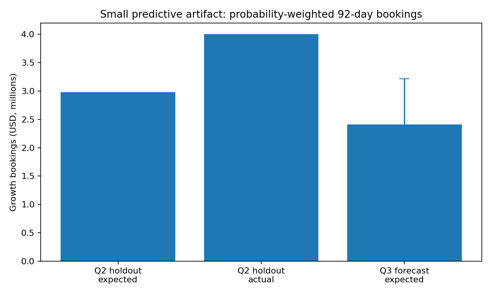

# Predictive artifact: Q3 2026 growth bookings forecast

I chose a **next-92-day New Business + Expansion bookings forecast** because it is directly usable by the CRO and does not require inventing churn labels from incomplete historical product coverage.

## Method

A regularized logistic regression estimates each open opportunity's probability of becoming Closed Won in the next 92 days. The forecast is the sum of `probability × opportunity amount`, with all amounts converted at the snapshot's observed FX rate.

**Features:** reconstructed stage as of the snapshot, opportunity type, lead source, account region, account segment, log opportunity amount, opportunity age, and days in current observed stage.

I deliberately excluded forecast `close_date` and `forecast_category` from training. The dataset is a current CRM extract, not a snapshot history of those fields; using today's values in a historical backtest would leak information that was not necessarily known at the time.

Opportunities with `amount <= 0`, internal/test/deleted accounts, and Renewal opportunities are excluded from the monetary forecast for the same reasons as the signed pipeline metric.

## Validation

Training uses seven quarter-end snapshots from 2024-06-30 through 2025-12-31. The untouched temporal holdout is the **2026-03-31** snapshot, predicting the following 92 days.

| Holdout result | Value |
|---|---:|
| ROC AUC | **0.737** |
| Average precision | **0.570** |
| Brier score | **0.154** |
| Expected Q2 bookings | **$2.976M** |
| Actual Q2 bookings | **$3.999M** |
| Dollar forecast error | **−25.6%** |

The ranking signal is useful, but the one-quarter dollar backtest is conservative. I would **not** use this model for compensation or a board commitment without more snapshot history and calibration backtests.

## Q3 2026 forecast as of 2026-06-30

- Open valued growth pipeline scored: **144 opportunities / $16.978M**.
- Probability-weighted expected bookings: **$2.412M**.
- Monte Carlo P10 / median / P90: **$1.659M / $2.374M / $3.218M**.

The simulated interval captures deal-level Bernoulli uncertainty only. It does **not** fully capture correlated macro shocks, amount changes, pushed deals, or systematic calibration error; the Q2 underprediction is the clearest warning about that limitation. A second limitation is snapshot fidelity: stage is reconstructed from history, but fields such as amount, lead source, and account attributes come from the current extract because historical versions were not supplied. I avoid the most obvious leakage fields, but I would require CRM snapshot/SCD history before productionizing the backtest.

## How a rep or leader would use it

A leader uses the total and range for a conservative quarter outlook; a manager uses `outputs/pipeline_forecast_scores.csv` to review the highest expected-bookings opportunities first, not to auto-close or auto-prioritize deals without rep context.
