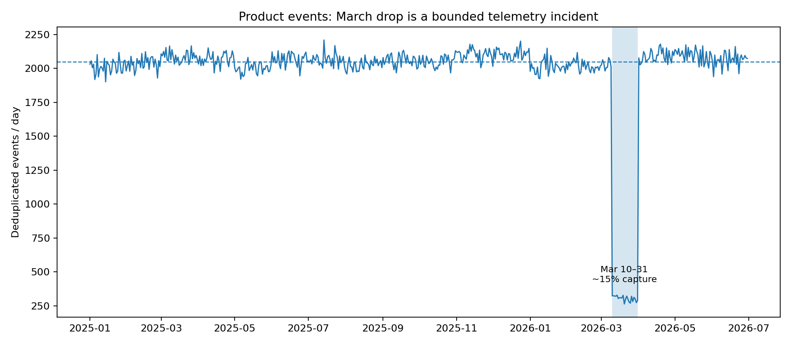

# Recommendation: do not fund a broad re-onboarding programme from this signal

## Claim

The data does **not** support the CS team's claim that product engagement fell sharply **from March onwards**. It supports a narrower and more operationally important conclusion: product telemetry under-captured activity from **2026-03-10 through 2026-03-31**, then recovered immediately on **2026-04-01**. Funding a broad re-onboarding programme from the March chart would treat an instrumentation problem as a customer-behaviour problem.

## Evidence

After deduplicating 3,200 at-least-once event deliveries and removing 240 events after the case cut-off:

- Mar 1–9 averaged **2,031 events/day**.
- Mar 10–31 averaged **304 events/day**.
- Apr 1–9 immediately returned to **2,066 events/day**.
- The incident window therefore captured only about **15%** of expected volume, implying roughly **38.4k missing events**.
- The drop is broad and mechanically similar across all eight event types and all regions, which is much more consistent with telemetry loss than coordinated customer disengagement.
- Most importantly, **Apr–Jun averages 2,083 events/day**, **3.4% above Jan–Feb's 2,015/day**. There is no persistent post-March decline.

The CS health signal also does not rescue the broad claim: latest risk is heterogeneous, and many High-risk accounts have stable or rising usage. Usage and health should be combined at account grain rather than treating a platform-wide March count as causal evidence.

## Size of the opportunity

I would still intervene where independent signals agree. I defined a narrow operational cohort as:

1. Apr–Jun monthly event run-rate is **<80%** of Jan–Feb run-rate (so the decline persists after telemetry recovered),
2. latest CS renewal risk is **Medium or High**, and
3. the next effective contract event is within **180 days**.

That leaves **4 accounts representing $522.7k ARR** (~1.5% of current ARR), not the entire 296-account base. The exact accounts are shipped in `outputs/targeted_reengagement_accounts.csv`.

## Action

**Do not approve a broad re-onboarding budget yet.** First, have Product/Data Platform root-cause the Mar 10–31 telemetry incident and add a completeness monitor (daily events, active accounts, and event-type mix versus trailing baseline). In parallel, have CS run a focused 4-account re-engagement pilot on the $522.7k ARR cohort above, with a pre-defined success metric: recovery in post-incident usage plus renewal-risk movement before the contract event.

If that pilot works, expand using the account-level rule. If it does not, the company has avoided spending next-quarter budget on a programme justified by a broken aggregate signal.

## What changed my initial view

The monthly chart initially makes March look like a genuine usage collapse. The conclusion became unreliable once I looked at the daily boundary: volume is normal through March 9, falls discontinuously on March 10 across every product action, and returns discontinuously on April 1. That shape is the reason I would not let the monthly aggregate drive a customer intervention.
